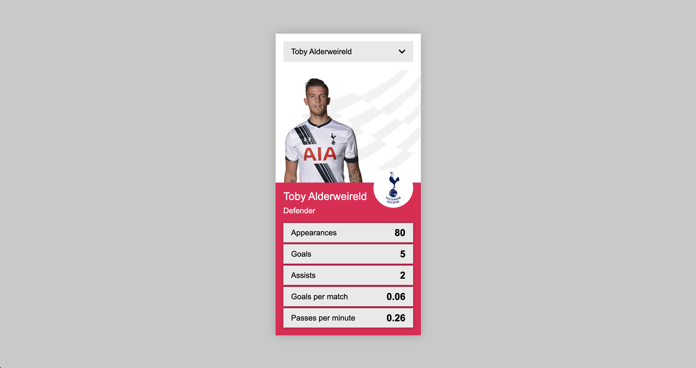

# Player Stat Card

The goal for this project was to build a stats card component that allows the user to select from a list of players and view the relevant stats for that player. The component should function and display accurately in Chrome, Firefox and Edge.

## Contents

- [Technologies Used](#technologies-used)
  - [Languages](#languages)
  - [Packages](#packages)
  - [Other Tools](#other-tools)
- [Project Setup](#project-setup)
- [Deployment](#deployment)
- [Credits](#credits)

---

## Technologies Used

### Languages

- [HTML](https://developer.mozilla.org/en-US/docs/Web/HTML)
- [CSS](https://developer.mozilla.org/en-US/docs/Web/CSS)
- [Sass](https://sass-lang.com/)
- [JavaScript](https://javascript.info/)

### Packages

The following packages are required for this project and are installed as dev dependencies:

- [Gulp](https://gulpjs.com/)
  - Task runner which will run compilation task
- [Gulp-Autoprefixer](https://www.npmjs.com/package/gulp-autoprefixer)
  - Adds any required vendor prefixes to compiled css
- [Gulp-Sass](https://www.npmjs.com/package/gulp-sass)
  - Compile sass files into css
- [Sass](https://www.npmjs.com/package/sass)
  - CSS preprocessor

### Other Tools

- [Affinity Designer](https://affinity.serif.com/en-gb/designer/)
  - Affinity Designer was used to view the .psd file for information on colours and fonts used. It was also used to save the background pattern as a .png file to add to the component.
- [Font Awesome](https://fontawesome.com/)
  - Used to add a chevron icon to the dropdown menu
- [Git](https://git-scm.com/)
  - Git was used for version control by utilising the terminal in VS Code to commit to Git and push to GitHub
- [GitHub](https://github.com/)
  - GitHub was used to store the code for this project
- [NodeJS](https://nodejs.org/en/)
  - JavaScript runtime environment
- [npm](https://www.npmjs.com/)
  - Used to install and manage packages
- [Visual Studio Code](https://code.visualstudio.com/)
  - Visual Studio Code was the editor used to create this project

[Back to Contents](#contents)

---

## Project Setup

This project was created using the steps outlined below:

- Before creating any files or folders, ensure you have [NodeJS](https://nodejs.org/en/) installed on your machine
- You can check this by opening the terminal and running the `node -v` command to see which version of NodeJS you have installed
- If you don't have NodeJS installed, you can download and install it from [https://nodejs.org/en/](https://nodejs.org/en/)
- NodeJS will come with npm which will be used to install packages - you can check this is installed by running the `npm -v` command
- From here, you can start creating folders and files from your project
- Before installing any packages, first run `npm init` to create a package.json - this will list all the required packages for the project
- Install the packages listed above as dev dependencies using `npm install package_name --save-dev`
- Create a gulp file with functions to compile scss files into css and watch for any changes to scss files on live server

### Cloning the Repository

To clone the repositiory and make a local copy on your machine, follow the steps outlined below:

- Open GitHub and locate the GitHub repository: [https://github.com/KirstChat/player-stats-card](https://github.com/KirstChat/player-stats-card)
- Under the repository name, click **Code** and copy the link to clone the repository using **HTTPS**
- After copying the link, open a terminal on your local machine or a terminal in your preferred IDE or Code Editor
- Change from your root directory to where you want to store the repository: e.g `cd documents/your_folder_name`
- You can create a folder uisng the command: `mkdir your_folder_name`
- When you are in your preferred folder, type `git clone` and paste in the copied url: [https://github.com/KirstChat/player-stats-card.git](https://github.com/KirstChat/player-stats-card.git)
- Press Enter to create a copy of the repository on your local machine
- Navigate into the repository folder: `cd player-stats-card`
- Run `npm install` to install and required packages to run the project
- To compile any changes to your scss files and watch for any changes in live server, use `npm run gulp` to run the gulpfile

[Back to Contents](#contents)

---

## Deployment

This project was created in VS Code and pushed to GitHub using the steps outlined below:

- Create a new folder in your preferred directory on your local machine
- Open the folder in VS Code to start creating files
- Open source control in VS Code and select **Publish to GitHub** - this can be found on the left side of the window
- If prompted, sign-in to GitHub to connect your account to VS Code
- Give your repository a name and select **Publish to GitHub Public Repository**
- After the repository is successfully published to GitHub, you can use git to add, commit and push any changes to the GitHub repository
- To stage a file to commit, use `git add your_file`
- You can also stage all files for commit using `git add .`
- After adding a file to commit, use `git commit -m "add commit message here"` to specify what changes you have made to the file
- After commiting a file, use `git push` to push all staged changes to your GitHub Repository

[Back to Contents](#contents)

---

## Credits

### Code

- [Sass Tutorial by The Net Ninja](https://www.youtube.com/watch?v=_kqN4hl9bGc&list=PL4cUxeGkcC9jxJX7vojNVK-o8ubDZEcNb)
  - This tutorial was used as a refresh crash course on Sass to meet the project requirements.
- [Gulp Setup by Coding in Public](https://www.youtube.com/watch?v=ubHwScDfRQA)
  - This tutorial provide some insight into other packages to install and add to the gulpfile. I decided to add the gulp-autoprefixer to autoprefix any css if required.
- [Stackoverflow: JavaScript forEach only returning last value](https://stackoverflow.com/questions/46808693/foreach-prints-only-last-value-the-typical-closure-issue-in-javascript)
  - I was initally having trouble displaying all the player names in the dropdown menu and the first answer helped with approaching the problem in a different way by appending a child element to the HTML instead of updating the innerHTML of the parent.
- [Stackoverflow: Return last word in a string](https://stackoverflow.com/questions/20883404/javascript-returning-the-last-word-in-a-string)
  - The first answer was a reminder on how to return the last word in a string to display the players position in the HTML.
- [Structuring your sass project](https://itnext.io/structuring-your-sass-projects-c8d41fa55ed4)
  - This article explained how to structure sass files for smaller projects.

### Images

I was unsure how to get the team badges from the provided badges_sprite.png, so downloaded the follwoing badge images as an alternative:

- [Tottenham Hotspur Logo](https://en.wikipedia.org/wiki/Tottenham_Hotspur_F.C.)
- [Manchester City Logo](https://en.wikipedia.org/wiki/Manchester_City_F.C.)
- [Manchester City Logo](https://en.wikipedia.org/wiki/Manchester_United_F.C.)
- [Arsenal Logo](https://en.wikipedia.org/wiki/Arsenal_F.C.)
- [Leicester City Logo](https://en.wikipedia.org/wiki/Leicester_City_F.C.)

[Back to Contents](#contents)

---
